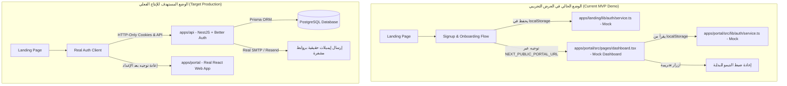

# خطة تنظيف الأكواد التجريبية (Demo Cleanup) والانتقال للإنتاج الفعلي (Production)

> **الغرض من هذا الدليل:**  
> توثيق وحصر جميع الملفات والأكواد المؤقتة، والبيانات الوهمية (Mock Data)، وعناصر التحكم الخاصة بالعرض التجريبي (Client Demo Controls) التي تم بناؤها خصيصاً لتقديم الـ MVP للعميل، وتوضيح كيفية حذفها واستبدالها بالبنية التحتية البرمجية الحقيقية (Real Production Code).

---

## فهرس المحتويات

1. [نظرة عامة على حالة النظام (MVP vs Production Architecture)](#1-نظرة-عامة-على-حالة-النظام)
2. [قائمة الملفات المقرر حذفها بالكامل (Files to Delete)](#2-قائمة-الملفات-المقرر-حذفها-بالكامل)
3. [الأكواد التجريبية المقرر استبدالها (Code to Replace / Refactor)](#3-الأكواد-التجريبية-المقرر-استبدالها)
   - [3.1 خدمة المصادقة الوهمية (apps/landing/lib/auth/service.ts)](#31-خدمة-المصادقة-الوهمية-appslandinglibauthservicets)
   - [3.2 عناصر تحكم الديمو في صفحة التحقق من البريد (email-verification.tsx)](#32-عناصر-تحكم-الديمو-في-صفحة-التحقق-من-البريد)
   - [3.3 زر محاكاة استعادة كلمة المرور (forgot-password-form.tsx)](#33-زر-محاكاة-استعادة-كلمة-المرور)
   - [3.4 الرمز الوهمي الاحتياطي (reset-password/page.tsx)](#34-الرمز-الوهمي-الاحتياطي)
   - [3.5 تدفق المصادقة الثنائية 2FA (two-factor-form.tsx)](#35-تدفق-المصادقة-الثنائية-2fa)
   - [3.6 إعادة توجيه الإعداد الأولي (onboarding/page.tsx)](#36-إعادة-توجيه-الإعداد-الأولي)
   - [3.7 أنواع البيانات التجريبية (apps/landing/lib/types.ts)](#37-أنواع-البيانات-التجريبية)
4. [البناء الفعلي المطلوب لمرحلة الإنتاج (Real Production Roadmap)](#4-البناء-الفعلي-المطلوب-لمرحلة-الإنتاج)
   - [4.1 ربط الـ Backend (NestJS + Better-Auth + Prisma)](#41-ربط-الـ-backend-nestjs--better-auth--prisma)
   - [4.2 تفعيل بوابة النظام الفعلية (apps/portal - Vite + React)](#42-تفعيل-بوابة-النظام-الفعلية-appsportal)
5. [جدول فحص وتدقيق التنظيف (Cleanup Checklist)](#5-جدول-فحص-وتدقيق-التنظيف)

---

## 1. نظرة عامة على حالة النظام



---

## 2. قائمة الملفات المقرر حذفها بالكامل

| الملف | المسار | السبب في وجوده حالياً | الإجراء بعد الديمو |
| :--- | :--- | :--- | :--- |
| **صفحة لوحة التحكم الوهمية** | [`apps/landing/src/app/[locale]/dashboard/page.tsx`](file:///home/youssef/projects/common/hr-platform/apps/landing/src/app/%5Blocale%5D/dashboard/page.tsx) | تم بناؤها داخل تطبيق الـ Landing Page لعرض تجربة كاملة للعميل من التسجيل وحتى رؤية بيانات شركته دون مغادرة الموقع. | **حذف الملف والمجلد بالكامل.** لوحة التحكم الفعلية مكانها داخل تطبيق البوابة المستقل [`apps/portal`](file:///home/youssef/projects/common/hr-platform/apps/portal). |

> [!WARNING]
> لا ينبغي أبداً بقاء مسار `/dashboard` داخل `apps/landing` في بيئة الإنتاج، لأن تطبيق الـ Landing مخصص للتسويق واستقطاب العملاء والمصادقة المبدئية فقط، بينما المنظومة الإدارية الكاملة تُشغَّل عبر النطاق الفرعي للبوابة (مثلاً: `https://app.luminahr.eg`).

---

## 3. الأكواد التجريبية المقرر استبدالها (Code to Replace / Refactor)

### 3.1 خدمة المصادقة الوهمية
- **الملفات:** 
  - [`apps/landing/lib/auth/service.ts`](file:///home/youssef/projects/common/hr-platform/apps/landing/lib/auth/service.ts)
  - [`apps/portal/src/lib/auth/service.ts`](file:///home/youssef/projects/common/hr-platform/apps/portal/src/lib/auth/service.ts) (نسخة البوابة)
- **الكود التجريبي الحالي:**
  - تخزين بيانات التسجيل والإعداد في `localStorage` بمفتاح `lumina_auth_mock_state`.
  - محاكاة تأخير الشبكة عبر دالة `delay(ms)`.
  - إرجاع بيانات شركة وهمية ثابتة (`شركة النور للحلول البرمجية...`).
  - توفير دالة `logout()` لمسح الـ `localStorage` لتكرار تجربة العرض.
- **البديل الفعلي في الإنتاج:**
  - استبدال الخدمة بـ **API Client حقيقي** (مثل `@better-auth/client` أو استدعاءات `fetch` لـ NestJS API).
  - إرسال البيانات إلى `POST /api/auth/sign-up/email` و `POST /api/auth/sign-in/email`.
  - استخدام الجلسات الآمنة عبر ملفات تعريف الارتباط المشفرة `HttpOnly Cookies` بدلاً من `localStorage`.

```typescript
// ❌ الكود الحالي (Mock Service):
const STORAGE_KEY = 'lumina_auth_mock_state';
export const authService = {
  async signup(payload: SignupPayload) {
    await delay(1000);
    saveStoredState({ ...payload });
    return { success: true, data: { userId: 'mock-user-' + Date.now() } };
  }
};

//  الكود الفعلي للإنتاج:
import { createAuthClient } from 'better-auth/react';

export const authClient = createAuthClient({
  baseURL: process.env.NEXT_PUBLIC_API_URL, // e.g. https://api.luminahr.eg
});
```

---

### 3.2 عناصر تحكم الديمو في صفحة التحقق من البريد
- **الملف:** [`apps/landing/components/auth/verification/email-verification.tsx`](file:///home/youssef/projects/common/hr-platform/apps/landing/components/auth/verification/email-verification.tsx)
- **الأكواد المطلوب حذفها:**
  1. **صندوق أدوات العرض التجريبي (الأسطر 249 إلى 295):**
     يحتوي على كود البانل: `عرض تجريبي للعميل (Client Demo)` وأزرار `محاكاة تأكيد البريد الإلكتروني`، و`تجربة رابط منتهي`، و`تجربة رابط غير صالح`.
  2. **زر تجربة التأكيد السريع في حالة الخطأ (الأسطر 158 إلى 166):**
     زر `تجربة التأكيد الناجح` الذي يغير الحالة لـ `verified` مباشرة.
- **البديل الفعلي في الإنتاج:**
  - الاعتماد التام على فتح الرابط الفعلي المرسل عبر الإيميل الحقيقي:  
    `https://luminahr.eg/ar/verify-email?token=<signed_token>`
  - يقوم الكومبوننت بالتحقق من الـ Token عبر استدعاء الـ API الفعلي فقط؛ وفي حال عدم توفر Token أو انتهاء صلاحيته، يطلب من المستخدم إعادة إرسال الرابط.

---

### 3.3 زر محاكاة استعادة كلمة المرور
- **الملف:** [`apps/landing/components/auth/recovery/forgot-password-form.tsx`](file:///home/youssef/projects/common/hr-platform/apps/landing/components/auth/recovery/forgot-password-form.tsx)
- **الكود المطلوب حذفه (الأسطر 55 إلى 67):**
  ```tsx
  {/* MVP Demo Link to Reset Password */}
  <div className="pt-2">
    <button
      type="button"
      onClick={() => {
        window.location.href = `/${lang}/reset-password?token=valid`;
      }}
      className="..."
    >
      <span>{lang === 'ar' ? 'محاكاة: فتح رابط إعادة تعيين كلمة المرور' : 'Simulate: Open Reset Password Link'}</span>
      <span className="rtl:rotate-180">➔</span>
    </button>
  </div>
  ```
- **البديل الفعلي في الإنتاج:**
  - حذف زر المحاكاة تماماً.
  - الاكتفاء بعرض رسالة نجاح الإرسال وتنبيه المستخدم بضرورة التحقق من بريده الإلكتروني للضغط على الرابط الحقيقي.

---

### 3.4 الرمز الوهمي الاحتياطي
- **الملف:** [`apps/landing/src/app/[locale]/(auth)/reset-password/page.tsx`](file:///home/youssef/projects/common/hr-platform/apps/landing/src/app/%5Blocale%5D/%28auth%29/reset-password/page.tsx)
- **الكود الحالي (السطر 12):**
  ```tsx
  const token = searchParams.get('token') || 'mock-token';
  ```
- **البديل الفعلي في الإنتاج:**
  - حذف القيمة البديلة `'mock-token'`:
  ```tsx
  const token = searchParams.get('token');
  if (!token) {
    // إظهار تنبيه برابط غير صالح والامتناع عن إتاحة نموذج كتابة كلمة المرور الجديدة
  }
  ```

---

### 3.5 تدفق المصادقة الثنائية (2FA)
- **الملف:** [`apps/landing/components/auth/two-factor/two-factor-form.tsx`](file:///home/youssef/projects/common/hr-platform/apps/landing/components/auth/two-factor/two-factor-form.tsx)
- **الكود التجريبي الحالي:**
  - قبول أي 6 أرقام عشوائية.
  - توجيه المستخدم فوراً إلى `NEXT_PUBLIC_PORTAL_URL` (البوابة الفعلية التي تحتوي على الديمو حالياً).
  - دالة إعادة الإرسال (Resend) تقوم فقط بتفريغ الخانات برمجياً (Mock).
- **البديل الفعلي في الإنتاج:**
  - إرسال رمز OTP حقيقي عبر الرسائل النصية القصيرة (SMS) أو التحقق من كود تطبيق المصادقة (TOTP - Google Authenticator).
  - عند النجاح، يتم استلام مفتاح الجلسة النهائي الموثوق، وإعادة التوجيه إلى رابط بوابة الإدارة الفعلي (`apps/portal`).

---

### 3.6 إعادة توجيه الإعداد الأولي (Onboarding Complete)
- **الملف:** [`apps/landing/src/app/[locale]/(auth)/onboarding/page.tsx`](file:///home/youssef/projects/common/hr-platform/apps/landing/src/app/%5Blocale%5D/%28auth%29/onboarding/page.tsx)
- **الكود الحالي:** (تم التحديث للتوجيه الفعلي للبوابة)
  ```tsx
  const handleGoToDashboard = useCallback(() => {
    const portalUrl = process.env.NEXT_PUBLIC_PORTAL_URL || 'http://localhost:5174';
    window.location.href = `${portalUrl}?lang=${lang}`;
  }, [lang]);
  ```
- **البديل الفعلي في الإنتاج:**
  - الاعتماد على الرابط الفعلي دائماً، ولكن التأكد من استلام مفتاح جلسة سليم من الـ API قبل إعادة التوجيه.

---

### 3.7 أنواع البيانات التجريبية
- **الملف:** [`apps/landing/lib/types.ts`](file:///home/youssef/projects/common/hr-platform/apps/landing/lib/types.ts)
- **الواجهات التجريبية (الأسطر 9 إلى 37):**
  - `EmployeeDemo`
  - `BranchDemo`
  - `MetricData`
- **البديل الفعلي في الإنتاج:**
  - نقل كافة الـ Data Contracts والمخططات إلى الحزمة المركزية المشتركة:  
    [`packages/contracts/src/`](file:///home/youssef/projects/common/hr-platform/packages/contracts/src/)
  - الاعتماد على الـ Types المشتقة تلقائياً من Prisma Client في [`packages/database`](file:///home/youssef/projects/common/hr-platform/packages/database/prisma/schema.prisma) (`Company`, `Branch`, `Employee`, `User`).

---

## 4. البناء الفعلي المطلوب لمرحلة الإنتاج

> [!NOTE]
> بمجرد انتهاء جلسة استعراض الـ MVP للعميل، ينتقل التركيز بالكامل إلى تفعيل الجزئين الحقيقيين في الـ Monorepo: الـ Backend (`apps/api`) وتطبيق البوابة (`apps/portal`).

### 4.1 ربط الـ Backend (NestJS + Better-Auth + Prisma)

وفقاً لقواعد المعمارية في [`AGENTS.md`](file:///home/youssef/projects/common/hr-platform/AGENTS.md) والدليل الشامل في [`docs/BETTER_AUTH_GUIDE.md`](file:///home/youssef/projects/common/hr-platform/docs/BETTER_AUTH_GUIDE.md):

1. **بناء وحدات البنية التحتية (Infrastructure Modules):**
   - `src/lib/database/prisma.module.ts` + `prisma.service.ts` (معلّمة كـ `@Global()`).
   - `src/lib/mail/mail.module.ts` + `mail.service.ts` (لإرسال رسائل التحقق واستعادة كلمة المرور عبر SMTP أو Resend).
   - `src/lib/auth/auth.module.ts` + `auth.service.ts` (لتهيئة Better-Auth مع Prisma Adapter).
2. **بناء وحدات الميزات (Feature Modules):**
   - `src/module/company/` — إدارة تسجيل المنشأة وتحديث بياناتها وخطط الاشتراك.
   - `src/module/branch/` — إضافة وحذف وإدارة الفروع التشغيلية.
   - `src/module/onboarding/` — استقبال بيانات معالج الإعداد وحفظ الفروع والخيارات في قاعدة البيانات.
   - `src/module/employee/` — استيراد ملفات الإكسل وسجل بيانات الموظفين وعقودهم.

---

### 4.2 تفعيل بوابة النظام الفعلية (`apps/portal` - Vite + React)

الملف [`apps/portal/src/App.tsx`](file:///home/youssef/projects/common/hr-platform/apps/portal/src/App.tsx) حالياً يحتوي على نظام توجيه مبدئي وتطبيق `Mock Dashboard` يعتمد على الواجهات والبيانات الوهمية المنقولة من Landing.  
يجب استبدال البيانات الوهمية بالبنية التالية:
1. **نظام توجيه فعلي (React Router / TanStack Router)** يدعم حماية المسارات بالجلسة (`ProtectedRoute`) والتأكد من تسجيل الدخول الفعلي عبر الـ API.
2. **لوحة التحكم الرئيسية (Real Dashboard):** تعرض إحصائيات حقيقية من الـ API (عدد الموظفين الفعليين، نسب الحضور، تكلفة الرواتب).
3. **إدارة الموظفين (Employees Directory):** جدول ديناميكي يدعم البحث والفرز وعرض تفاصيل الموظف ومسيرات الرواتب.
4. **شجرة الفروع (Branches Management):** إدارة مقرات الشركة وربط كل فرع بمديره وموظفيه.

---

## 5. جدول فحص وتدقيق التنظيف (Cleanup Checklist)

استخدم هذا الجدول كقائمة مهام (Todo Checklist) لتنفيذ عملية التنظيف بعد موافقة العميل:

```markdown
- [ ] 1. حذف صفحة الـ Mock Dashboard السابقة من Landing:
      - [ ] حذف ملف apps/landing/src/app/[locale]/dashboard/page.tsx والمجلد التابع له
      - [x] إزالة أي روابط داخلية تشير إلى /[locale]/dashboard في Landing App (تم التوجيه لـ Portal)
- [ ] 2. تنظيف عناصر تحكم الديمو من شاشات المصادقة:
      - [ ] حذف بانل "Client Demo Controls" في apps/landing/components/auth/verification/email-verification.tsx
      - [ ] حذف زر "Simulate: Open Reset Password Link" في apps/landing/components/auth/recovery/forgot-password-form.tsx
      - [ ] إزالة fallback 'mock-token' من apps/landing/src/app/[locale]/(auth)/reset-password/page.tsx
- [ ] 3. استبدال خدمة المصادقة الوهمية (Mock Service):
      - [ ] استبدال apps/landing/lib/auth/service.ts بـ Real Better-Auth React Client
      - [ ] استبدال apps/portal/src/lib/auth/service.ts بالمصادقة الفعلية
      - [ ] إيقاف استخدام localStorage وتفعيل HttpOnly Session Cookies
- [x] 4. تحديث وجهات التوجيه النهائي:
      - [x] توجيه onboarding/page.tsx إلى رابط البوابة الفعلي NEXT_PUBLIC_PORTAL_URL
      - [x] توجيه login/page.tsx بعد استكمال 2FA إلى البوابة الفعلية
- [ ] 5. نقل وتنظيف الأنواع المشتركة:
      - [ ] نقل واجهات العقود من lib/types.ts إلى packages/contracts
      - [ ] تنظيف الكود ليعتمد على النماذج المولدة من Prisma Client
- [ ] 6. ربط وإطلاق الواجهات الخلفية (NestJS API Modules) وقاعدة بيانات PostgreSQL.
- [ ] 7. استبدال مكونات لوحة التحكم الوهمية (Mock Dashboard) داخل `apps/portal` بالبيانات الفعلية من الـ API.
```

---

> **ملاحظة أمان:**  
> جميع أكواد المحاكاة والـ Mock الحالية مصممة حصرياً لأغراض إبهار العميل في العرض التجريبي واختبار واجهات المستخدم وتجربة الاستخدام (UX/UI)، ولا تتضمن أي تخزين لكلمات مرور حقيقية أو بيانات إنتاج حساسة.
