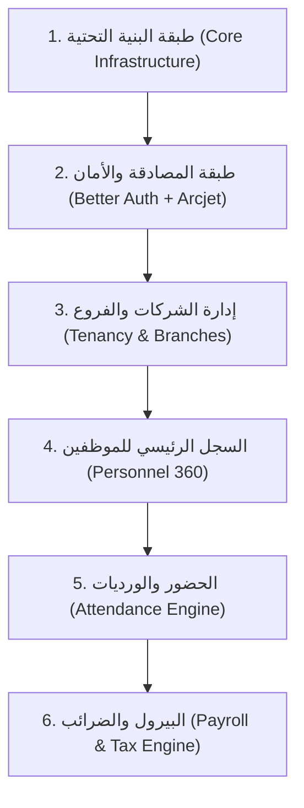

USER:
أريدك أن تقوم بتعليمي الآن كيف أبدأ ببناء الـ API في هذا المشروع وفقاً لقاعدة البيانات الحالية وما يجب إنشائه ومتى نستخدم `packages/` عند الحاجة إليها.

لا تقم بتعديل أي ملفات، فقط قم بتعليمي وتناقش معي في بناء الـ Backend لهذا المشروع وفقاً لمتطلباته [hr_system_design%20-%20Updated.md](file;vscode-remote://wsl%2Bubuntu/home/youssef/projects/common/hr-platform/docs/hr_system_design%20-%20Updated.md).

سنستخدم في الواجهة الخلفية @mcp:better-auth: و @mcp:arcjet 

AGENT:
Viewed SKILL.md:1-219
Viewed memory.md:1-39
Viewed hr_system_design%20-%20Updated.md:1-250
Listed directory hr-platform
Listed directory packages
Listed directory apps
Listed directory database
Listed directory prisma
Listed directory src
Viewed package.json:1-52
Viewed package.json:1-30
Listed directory contracts
Listed directory src
Viewed index.ts:1-18
Listed directory src
Viewed index.ts:1-23
Viewed index.ts:1-21
Viewed schema.prisma:1-100
Viewed schema.prisma:101-250
Listed directory modules
Listed directory auth
Listed directory common
Listed directory config
Viewed main.ts:1-9
Viewed app.module.ts:1-12
Viewed auth.module.ts:1-10
Viewed schema.prisma:251-450
Used MCP tool: better-auth/search_docs
Used MCP tool: better-auth/get_doc
Used MCP tool: better-auth/search_docs
Used MCP tool: better-auth/get_doc

### استعادة سياق المشروع (Session Continuity) 🔄

وفقاً لسجل الجلسة في [memory.md](file:///home/youssef/projects/common/hr-platform/memory.md):
- **ما تم في الجلسات السابقة:** تم بناء واجهات المستخدم (لوحة التحكم في تطبيق `portal`، وصفحات الهبوط والـ Onboarding في `landing`)، مع وجود محاكاة مؤقتة للـ Authentication عبر `localStorage`.
- **المحطة الحالية:** الانتقال إلى بناء وتجهيز الواجهة الخلفية (Backend API) في تطبيق [apps/api](file:///home/youssef/projects/common/hr-platform/apps/api) باستخدام NestJS 11، وربطها بقاعدة البيانات الحالية وتأمينها عبر **Better Auth** و **Arcjet**.

---

### أولاً: فلسفة الـ Monorepo — متى نستخدم `packages/` ومتى نكتب داخل `apps/api`؟

في هيكلية Turborepo، التمييز بين ما يدخل في الحزم المشتركة وما يبقى في التطبيق هو أساس نجاح النظام وتوسعه:

```
├── apps/
│   ├── api/             <-- خاص بـ NestJS و HTTP / REST Lifecycle فقط
│   ├── portal/          <-- تطبيق لوحة تحكم الموظفين والشركات (Vite/React)
│   └── landing/         <-- موقع الهبوط والتسجيل (Next.js)
└── packages/
    ├── database/        <-- Prisma Schema والـ Client والميجريشنز
    ├── contracts/       <-- واجهات الـ DTOs وأنواع الردود المشتركة
    └── payroll-engine/  <-- المنطق الحسابي المجرد (Pure Business Logic)
```

#### 1. متى نستخدم `packages/`؟
ننشئ أو نستخدم `package` في ثلاث حالات محددة:
1. **كود مشترك بين الـ Frontend والـ Backend (Shared Contracts & Types):**
   * مثل [packages/contracts](file:///home/youssef/projects/common/hr-platform/packages/contracts): يتم فيه تعريف الواجهات (`ApiResponse<T>`, `PaginatedResult<T>`) و DTOs و Zod Schemas. الفائدة هنا هي أن الـ Frontend والـ Backend يشاركان نفس الـ Schema للتحقق من المدخلات بدون تكرار.
2. **محركات أعمال بحتة (Pure Business / Domain Logic):**
   * مثل [packages/payroll-engine](file:///home/youssef/projects/common/hr-platform/packages/payroll-engine): محرك حساب ضريبة كسب العمل المصرية، شرائح الدخل، ونسب التأمينات الاجتماعية (11% موظف / 18.75% شركة).
   * **القاعدة:** هذا الكود يجب أن يكون دوال نقية (Pure Functions) بدون أي اعتماد على إطار عمل (خالي من NestJS أو React أو حتى Prisma). هذا يتيح لنا اختباره بـ Unit Tests بنسبة 100%، وتشغيله داخل الـ API أو في المتصفح أو في Background Worker.
3. **طبقة البيانات العامة (Data Layer):**
   * مثل [packages/database](file:///home/youssef/projects/common/hr-platform/packages/database): يضم [schema.prisma](file:///home/youssef/projects/common/hr-platform/packages/database/prisma/schema.prisma) ونواة الـ Prisma Client، حتى تتم مشاركته بين الـ API وسكريبتات التغذية (Seed scripts) أو أي أدوات صيانة أخرى.

#### 2. متى نكتب الكود داخل `apps/api`؟
* أي كود مرتبط بدورة حياة الـ HTTP الخاصة بـ **NestJS** ومفاهيمه:
  * Controllers, Services, Modules.
  * Guards (مثل حراس الصلاحيات وعزل الشركات).
  * Interceptors, Filters, Pipes.
  * تكوينات السيرفر وإعدادات Express.

---

### ثانياً: قراءة قاعدة البيانات الحالية ومواءمتها مع متطلبات النظام

قاعدة البيانات المصممة في [schema.prisma](file:///home/youssef/projects/common/hr-platform/packages/database/prisma/schema.prisma) تغطي بالفعل متطلبات وثيقة [docs/hr_system_design - Updated.md](file:///home/youssef/projects/common/hr-platform/docs/hr_system_design%20-%20Updated.md) بدقة متناهية:

1. **العزل التام والتعددية (Multi-Tenancy):**
   * جدول `Organization` يمثل الـ Tenant ومربوط بـ `SaaSPlan`.
   * **مبدأ الربط الثلاثي (Triple Binding):** كل سجل حساس (مثل `AttendanceRecord`, `PayrollItem`, `Employee`) يحمل دائماً `organizationId` + `branchId` + `employeeId` لضمان إمكانية تصفية البيانات ومقارنة الفروع بسهولة.
2. **الهيكل الوظيفي والإداري (Employee Master Data & Hierarchy):**
   * حقل `nationalIdEncrypted` لتخزين الرقم القومي مشفراً.
   * علاقة `managerId` كـ Self-relation على جدول `Employee` لتمثيل شجرة الإدارة ومقارنة أداء مديري الفروع والفرق.
3. **جداول Better Auth:**
   * تم استخدام هيكل جداول Better Auth الرسمية مع إضافة الـ Organization Plugin (`user`, `session`, `account`, `verification`, `member`, `invitation`).
4. **محرك الحضور والرواتب والامتثال:**
   * جداول `AttendanceSettings`, `EmployeeShift`, `ShiftException`, `OvertimeApproval`.
   * جدول `GlobalComplianceRule` لتخزين شرائح الضرائب ونسب التأمينات بنظام النسخ التاريخية (Versioned rules).

---

### ثالثاً: كيفية دمج Better Auth و Arcjet في NestJS

وفقاً لقواعد المشروع في [AGENTS.md](file:///home/youssef/projects/common/hr-platform/AGENTS.md)، نعتمد أسلوب NestJS-first:
* لا نقوم بعمل `new PrismaClient()` أو إنشاء خدمات يدوياً؛ كل شيء يتم عبر **Constructor Injection**.
* خدمات البنية التحتية (Infrastructure) توضع في وحدات معزولة مميزة بـ `@Global()`.

#### 1. دمج Better Auth:
* **تهيئة الـ Auth Instance:**
  يتم تهيئة مكتبة Better Auth وربطها بمحول الـ Prisma (`prismaAdapter`) مع تفعيل إضافة الـ Organizations Plugin و Two-Factor:
  ```ts
  // مثال توضيحي للمفهوم
  export const auth = betterAuth({
    database: prismaAdapter(prisma, { provider: "pg" }),
    plugins: [
      organization({
        allowUserToCreateOrganization: true,
      }),
      twoFactor(),
    ],
  });
  ```
* **تضمينها في NestJS:**
  * Better Auth توفر Handler متوافق مع Node/Express عن طريق `toNodeHandler(auth)`.
  * يتم عمل Middleware أو وحدة [auth.module.ts](file:///home/youssef/projects/common/hr-platform/apps/api/src/modules/auth/auth.module.ts) لتوجيه أي طلب إلى `/api/auth/*` مباشرة لمناول Better Auth.
* **الحراس والـ Decorators المخصصة:**
  * إنشاء Guard مثل `AuthGuard` يعتمد على `auth.api.getSession({ headers: fromNodeHeaders(req.headers) })`.
  * استخراج المستخدم الحالي `@CurrentUser()` والشركة النشطة `@CurrentOrg()` من الـ Session (`session.activeOrganizationId`).

#### 2. دمج Arcjet للحماية والحراسة (Security & Rate Limiting):
* مكتبة **Arcjet** تعمل كطبقة حماية متقدمة للـ API:
  * **Rate Limiting:** حماية نقاط الدخول الحساسة (مثل تسجيل الدخول، إنشاء الحساب، طلب OTP) ضد هجمات الـ Brute-Force و DoS.
  * **Bot Detection:** منع الـ automated bots والـ scrapers من استهلاك موارد السيرفر.
  * **Attack Protection (Shield):** فحص الطلبات لمنع محاولات الـ SQL Injection والـ Common Web Exploits.
* **كيف يتم دمجها في NestJS؟**
  * نقوم بإنشاء `ArcjetModule` كوحدة عالمية `@Global()` تقدم خدمة `ArcjetService`.
  * إنشاء حارس `ArcjetGuard` يمكن تطبيقه على مستوى الـ Controller أو مسار معين عبر Decorator مخصص مثل `@ProtectRoute()`.

---

### رابعاً: خطة بناء الـ Backend (Roadmap) المقترحة

للانطلاق في البناء بشكل احترافي، نقترح السير في المراحل التالية:



1. **المرحلة 1: البنية التحتية (Core Modules)**
   * إنشاء `PrismaModule` و `PrismaService` داخل `apps/api/src/lib/database/` كـ `@Global()`.
   * إعداد فلتر للأخطاء العامة `HttpExceptionFilter` ومحول الردود `TransformInterceptor` لتوحيد مخرجات الـ API بناءً على [packages/contracts](file:///home/youssef/projects/common/hr-platform/packages/contracts).

2. **المرحلة 2: المصادقة والحماية (Auth & Security Layer)**
   * تفعيل Better Auth في الـ API ومعالجة التوكن والـ Sessions.
   * إعداد حارس `AuthGuard` مع استخراج الـ `TenantId` (`OrganizationId`).
   * إعداد حارس Arcjet على مسارات الدخول والتسجيل.

3. **المرحلة 3: النواة التنظيمية (Organizations & Branches)**
   * بناء `OrganizationsModule` و `BranchesModule`.
   * التأكد من تطبيق قواعد عزل البيانات (Data Isolation) بحيث لا تستطيع أي شركة رؤية فروع أو بيانات شركة أخرى.

4. **المرحلة 4: شؤون الموظفين (Employee Master Data)**
   * بناء `EmployeesModule`.
   * تطبيق تشفير الرقم القومي، وربط الموظف بالمدير المباشر (`managerId`).

5. **المرحلة 5: محرك الحضور والرواتب (Attendance & Payroll)**
   * استهلاك محرك الضرائب من [packages/payroll-engine](file:///home/youssef/projects/common/hr-platform/packages/payroll-engine) داخل خدمات الـ Payroll في NestJS.

---

### نقطة الانطلاق والنقاش

ما رأيك في هذا التسلسل؟ وهل تفضل أن نبدأ أولاً بمناقشة **تهيئة `PrismaModule` وربط الـ Client داخل NestJS وفق أفضل ممارسات الـ Dependency Injection**، أم ننتقل مباشرة لمناقشة **هيكلة Better Auth وطريقة استخراج الـ Tenant Session**؟

USER:
أفضل البدء بهذا التسلسل الذي قمت بتخطيطه

AGENT:
ممتاز جداً! بما أننا اتفقنا على خطة العمل، سنبدأ الآن بـ **المرحلة الأولى: طبقة البنية التحتية الأساسية (Core Infrastructure)**.

في هذه المرحلة سنبني الأساس الصلب الذي ستعتمد عليه كل الـ Feature Modules القادمة. سنشرحها خطوة بخطوة وفقاً لمعايير NestJS وقواعد المشروع المحددة في [AGENTS.md](file:///home/youssef/projects/common/hr-platform/AGENTS.md).

---

### 1. ربط الحزم المشتركة بـ `apps/api`

قبل كتابة كود الـ Database في NestJS، يجب أن يعرف تطبيق [apps/api](file:///home/youssef/projects/common/hr-platform/apps/api) الحزم المشتركة الموجودة في `packages/`.
حالياً، ملف [apps/api/package.json](file:///home/youssef/projects/common/hr-platform/apps/api/package.json) يحتوي فقط على مكتبات NestJS الأساسية.

#### ما نحتاجه هنا:
إضافة الحزم المحلية كـ dependencies:
```json
{
  "dependencies": {
    "@repo/database": "workspace:*",
    "@repo/contracts": "workspace:*"
  }
}
```
* **`@repo/database`**: يتيح لنا استيراد الـ `PrismaClient` ونماذج الـ Types (مثل `Organization`, `Employee`, `User`).
* **`@repo/contracts`**: يتيح لنا استيراد أشكال الردود المعيارية (`ApiResponse<T>`, `PaginatedResult<T>`).

---

### 2. معمارية `PrismaModule` و `PrismaService`

وفقاً لقواعد [AGENTS.md](file:///home/youssef/projects/common/hr-platform/AGENTS.md):
> *"Every infrastructure integration gets its own module and service: src/lib/database/prisma.module.ts + prisma.service.ts. Mark infrastructure modules @Global() and import once in AppModule. Never instantiate services directly."*

#### أ. خدمة الـ Database: `prisma.service.ts`
المسار المقترح: `apps/api/src/lib/database/prisma.service.ts`

الخدمة ترث من `PrismaClient` (أو تُغلّفه) وتستمع لأحداث دورة حياة NestJS (`OnModuleInit` و `OnModuleDestroy`):

```typescript
import { Injectable, OnModuleInit, OnModuleDestroy, Logger } from '@nestjs/common';
import { PrismaClient } from '@repo/database';

@Injectable()
export class PrismaService extends PrismaClient implements OnModuleInit, OnModuleDestroy {
  private readonly logger = new Logger(PrismaService.name);

  async onModuleInit() {
    this.logger.log('Connecting to PostgreSQL database...');
    await this.$connect();
    this.logger.log('Database connected successfully.');
  }

  async onModuleDestroy() {
    this.logger.log('Disconnecting from database...');
    await this.$disconnect();
  }
}
```

* **لماذا نرث من `PrismaClient` ونربط مع `OnModuleInit`؟**
  1. يضمن عدم تشغيل السيرفر واستقبال الطلبات إلا بعد التأكد من صحة الاتصال بقاعدة البيانات.
  2. قطع الاتصال النظيف (Graceful Shutdown) عند إيقاف السيرفر بفضل `onModuleDestroy`.

#### ب. وحدة الـ Database: `prisma.module.ts`
المسار المقترح: `apps/api/src/lib/database/prisma.module.ts`

```typescript
import { Global, Module } from '@nestjs/common';
import { PrismaService } from './prisma.service.js';

@Global()
@Module({
  providers: [PrismaService],
  exports: [PrismaService],
})
export class PrismaModule {}
```

* **لماذا جعلناها `@Global()`؟**
  قاعدة البيانات بنية تحتية يحتاجها تقريباً كل موديول في النظام (`EmployeesModule`, `AttendanceModule`, `PayrollModule`...). وجود `@Global()` يسمح لنا بحقن `PrismaService` في أي سيرفس مباشرة عبر الـ Constructor دون الحاجة لكتابة `imports: [PrismaModule]` في كل موديول.

---

### 3. توحيد مخرجات الـ API ومعالجة الأخطاء (Standardization)

في [packages/contracts/src/index.ts](file:///home/youssef/projects/common/hr-platform/packages/contracts/src/index.ts) يوجد العقد التالي:
```typescript
export interface ApiResponse<T = unknown> {
  success: boolean;
  data?: T;
  error?: {
    code: string;
    message: string;
    details?: unknown;
  };
}
```

لضمان أن الـ Frontend (سواء `portal` أو `landing`) يستقبل دائماً ردوداً متسقة، ننشئ في NestJS شيئين في مجلد `src/common/`:

#### أ. محول الردود الناجحة: `TransformInterceptor`
المسار: `apps/api/src/common/interceptors/transform.interceptor.ts`

يقوم باعتراض أي رد خارج من الـ Controllers وتغليفه داخل هيكل `ApiResponse`:
```typescript
import {
  Injectable,
  NestInterceptor,
  ExecutionContext,
  CallHandler,
} from '@nestjs/common';
import { Observable } from 'rxjs';
import { map } from 'rxjs/operators';
import { ApiResponse } from '@repo/contracts';

@Injectable()
export class TransformInterceptor<T> implements NestInterceptor<T, ApiResponse<T>> {
  intercept(context: ExecutionContext, next: CallHandler): Observable<ApiResponse<T>> {
    return next.handle().pipe(
      map((data) => ({
        success: true,
        data,
      })),
    );
  }
}
```
* النتيجة: المطور في الـ Controller يرجع فقط الكائن (مثلاً `return employee;`)، والـ Interceptor يتكفل بتحويله إلى `{ success: true, data: employee }`.

#### ب. فلتر الأخطاء العام: `HttpExceptionFilter`
المسار: `apps/api/src/common/filters/http-exception.filter.ts`

يلتقط أي خطأ يقع في التطبيق (سواء Validation error، أو Prisma error، أو `NotFoundException`) ويصوغه بنفس الشكل:
```typescript
import {
  ExceptionFilter,
  Catch,
  ArgumentsHost,
  HttpException,
  HttpStatus,
  Logger,
} from '@nestjs/common';
import { Response } from 'express';
import { ApiResponse } from '@repo/contracts';

@Catch()
export class HttpExceptionFilter implements ExceptionFilter {
  private readonly logger = new Logger(HttpExceptionFilter.name);

  catch(exception: unknown, host: ArgumentsHost) {
    const ctx = host.switchToHttp();
    const response = ctx.getResponse<Response>();

    const status =
      exception instanceof HttpException
        ? exception.getStatus()
        : HttpStatus.INTERNAL_SERVER_ERROR;

    const exceptionResponse =
      exception instanceof HttpException ? exception.getResponse() : null;

    const message =
      typeof exceptionResponse === 'object' && exceptionResponse !== null
        ? (exceptionResponse as any).message || exception.toString()
        : exception instanceof Error
          ? exception.message
          : 'Internal server error';

    const errorPayload: ApiResponse = {
      success: false,
      error: {
        code: HttpStatus[status] || 'UNKNOWN_ERROR',
        message: Array.isArray(message) ? message.join(', ') : message,
      },
    };

    this.logger.error(`HTTP Status: ${status} Error: ${JSON.stringify(errorPayload.error)}`);

    response.status(status).json(errorPayload);
  }
}
```

---

### 4. التجميع والتشغيل في `main.ts` و `app.module.ts`

1. **في [app.module.ts](file:///home/youssef/projects/common/hr-platform/apps/api/src/app.module.ts):**
   نستورد `PrismaModule` مرة واحدة فقط:
   ```typescript
   @Module({
     imports: [
       PrismaModule,
       AuthModule,
     ],
   })
   export class AppModule {}
   ```

2. **في [main.ts](file:///home/youssef/projects/common/hr-platform/apps/api/src/main.ts):**
   تفعيل الـ Global Interceptor والـ Global Filter، مع تفعيل `ValidationPipe` للتحقق من المدخلات عبر `class-validator`:
   ```typescript
   app.useGlobalInterceptors(new TransformInterceptor());
   app.useGlobalFilters(new HttpExceptionFilter());
   app.useGlobalPipes(new ValidationPipe({ whitelist: true, transform: true }));
   ```

---

### خلاصة هذه الخطوة وماذا تعني لنا:
1. قاعدة البيانات أصبحت مهيأة وجاهزة للحقن في أي خدمة بدون أي إنشاء يدوي (`new PrismaClient()`).
2. أي Endpoint سنبنيه مستقبلاً سيلتزم تلقائياً بعقد البيانات المشترك بين الواجهة الخلفية والأمامية (`success`, `data`, `error`).

هل النمط المعماري لهذه البنية التحتية واضح لك تماماً، أم تحب أن نتناقش في أي تفصيلة منها قبل الانتقال إلى **المرحلة الثانية (Better Auth + Arcjet)**؟

USER:
1. لما قمنا بحذف الـ Controller من [prisma.module.ts](file;vscode-remote://wsl%2Bubuntu/home/youssef/projects/common/hr-platform/apps/api/src/lib/database/prisma/prisma.module.ts) وماذا سنفعل بالـ Controller الخاص بها؟
2. توجد مشكلة هنا [http-exception.filter.ts#L29-29](textBlock;vscode-remote://wsl%2Bubuntu/home/youssef/projects/common/hr-platform/apps/api/src/common/filters/http-exception.filter.ts#L29-29) 
3. أشعر أن هذه الأكواد معقدة لأنني لم اتعلم NestJS بعد

AGENT:
Ran command: `pnpm --filter api check-types`

شعورك طبيعي جداً ومفهوم 100%! الانتقال إلى **NestJS** لأول مرة قد يبدو مربكاً بسبب كثرة المفاهيم الجديدة (مثل Decorators و Modules و Dependency Injection و Interceptors).

دعنا نفكك هذا التعقيد معاً ونجيب على تساؤلاتك بدقة وبساطة شديدة:

---

### 1. لماذا حذفنا الـ Controller من `PrismaModule`؟ وماذا نفعل بملف `prisma.controller.ts`؟

#### الفكرة ببساطة:
* **ما هو الـ Controller في NestJS؟**
  الـ Controller هو **"نافذة على العالم الخارجي"**؛ وظيفته الوحيدة استقبال طلبات الـ HTTP من المتصفح أو التطبيق (مثل `GET /employees` أو `POST /login`).
* **لماذا لا نريد `PrismaController`؟**
  قاعدة البيانات هي **بنية تحتية داخلية سرية** للسيرفر، ولا نريد أبداً أن نفتح مساراً على الإنترنت اسمه `/prisma` يمكن للناس إرسال طلبات له مباشرة!
* اتصال الداتابيز يتم عبر الخدمة **`PrismaService`** فقط، وهذه الخدمة يتم حقنها داخل خدمات أخرى (مثل `EmployeesService` أو `PayrollService`)، وتلك الخدمات هي التي تتصل بالـ Controllers المناسبة لها.

#### ماذا تفعل بملف `prisma.controller.ts`؟
👉 **احذفه تماماً!** (هو وأي ملف اختبار له مثل `prisma.controller.spec.ts`).
وجوده كان مجرد نتيجة تلقائية إذا تم استخدام أمر CLI لإنشاء الموديول، ولا يوجد له أي دور في النظام.

---

### 2. مشكلة السطر 30 في `http-exception.filter.ts`

السطر المذكور:
```typescript
? (exceptionResponse as any).message || exception.toString()
```

#### سبب المشكلة:
1. استخدام الكلمة `as any` يتجاوز التحقق من الأنواع في TypeScript، وأداة الفحص (`oxlint` أو `tsc`) تعترض على استخدام `any` لأنها تقلل من أمان الكود (Type Safety).
2. في NestJS، عندما يرمي كود معين خطأ (`HttpException`)، أحياناً يكون الرد مجرد نص `string`، وأحياناً يكون كائناً `object` يحتوي على `message` (والتي قد تكون نصاً أو مصفوفة نصوص إذا كان خطأ تحقق من المدخلات Validation Error).

#### الكود الصحيح والنظيف (Type-Safe بدون `any`):

يمكنك استبدال الجزء الخاص باستخراج الرسالة بهذا الشكل الأكثر وضوحاً وأماناً:

```typescript
    let message: string = 'Internal server error';

    if (exception instanceof HttpException) {
      const res = exception.getResponse();
      if (typeof res === 'string') {
        message = res;
      } else if (typeof res === 'object' && res !== null && 'message' in res) {
        const resMessage = (res as { message: unknown }).message;
        message = Array.isArray(resMessage) ? resMessage.join(', ') : String(resMessage);
      }
    } else if (exception instanceof Error) {
      message = exception.message;
    }
```

* **ما الذي يفعله هذا الكود ببساطة؟**
  1. إذا كان الخطأ مجرد نص، يأخذه كما هو.
  2. إذا كان كائناً وفيه خاصية `message` (مثل أخطاء التحقق من صحة الإيميل أو كلمة المرور)، إذا كانت مصفوفة يدمجها بفاصلة، وإذا كانت نصاً يأخذها.
  3. إذا كان خطأ عاماً في JavaScript (`Error`)، يأخذ `exception.message`.
  4. خالٍ تماماً من `any` ومتوافق مع قواعد TypeScript الصارمة.

---

### 3. "أشعر أن هذه الأكواد معقدة لأنني لم أتعلم NestJS بعد"

دعني أشرح لك NestJS بتشبيه واقعي جداً سيجعلك ترى الصورة كاملة:

تخيل أن تطبيق الـ Backend عبارة عن **"مطعم متكامل"**:

```
العميل ( المتصفح / الفرونت إند )
       │ (Request)
       ▼
1. Controller (موظف الاستقبال / النادل)
       │ يستلم الطلب ويمرره للمطبخ
       ▼
2. Service (الشيف في المطبخ - المنطق الفعلي)
       │ يحتاج خضار ولحوم من المخزن
       ▼
3. PrismaService (أمين المخزن - قاعدة البيانات)
```

1. **الـ Controller (الويتر):**
   * لا يطبخ ولا يدخل المخزن. فقط يأخذ طلب العميل من الرابط، ويمرره للشيف المناسب، ثم يعيد الوجبة للعميل.
2. **الـ Service (الشيف):**
   * هذا هو المكان الذي يُكتب فيه كود الـ Business Logic (مثلاً: حساب ساعات التأخير، حساب ضريبة كسب العمل، التأكد من أن رصيد الإجازات كافٍ).
3. **الـ Module (الصندوق الجامع):**
   * في المطعم، لديك قسم للمخبوزات وقسم للمشويات. الـ Module هو الملف الذي يجمع (الويتر + الشيف) الخاصين بموضوع محدد ويقول: "هؤلاء يعملون معاً" (مثال: `AuthModule`, `EmployeesModule`).
4. **حقن التبعيات (Dependency Injection - السحر الحقيقي لـ NestJS):**
   * في لغات البرمجة العادية، لو الشيف يحتاج المخزن كان سيكتب: `const db = new PrismaClient()`.
   * في NestJS، الشيف لا يشتري أدواته بنفسه! فقط يكتب في الـ Constructor:
     ```typescript
     constructor(private prisma: PrismaService) {}
     ```
     وNestJS يتكفل تلقائياً بإعطائه النسخة الجاهزة للعمل.

#### وماذا عن الـ Interceptor والـ Filter التي كتبناها للتو؟
* **الـ Interceptor (قسم التعبئة والتغليف):**
  بدل أن نطلب من كل شيف وضع الطعام في علبة موحدة، الـ Interceptor يقف عند الباب ويأخذ أي طبق خارج ويلفه في علبة موحدة:
  `{ success: true, data: الوجبة }`.
* **الـ Filter (فريق الطوارئ):**
  لو انكسر طبق أو حدث حريق في المطبخ، بدلاً من أن ينهار المطعم، يتدخل الـ Filter فوراً ويعتذر للعميل بلباقة وبنفس العلبة الموحدة:
  `{ success: false, error: { message: "حدث خطأ ما" } }`.

---

### بشرى تطمئنك:
**أصعب خطوة في أي مشروع NestJS هي هذه الخطوة التأسيسية الأولى (Infrastructure Setup)**؛ لأنها مليئة بالإعدادات العامة التي تُكتب مرة واحدة فقط.
بمجرد انتهائنا منها، ستجد أن بناء باقي الميزات (مثل إضافة موظف، تسجيل حضور) يتكرر بنفس النمط البسيط والممتع:
*(Controller يستقبل ⬅️ Service ينفذ ⬅️ Prisma يحفظ)*.

هل الصورة أصبحت أوضح الآن؟ وكيف تحب أن نواصل الخطوة التالية؟